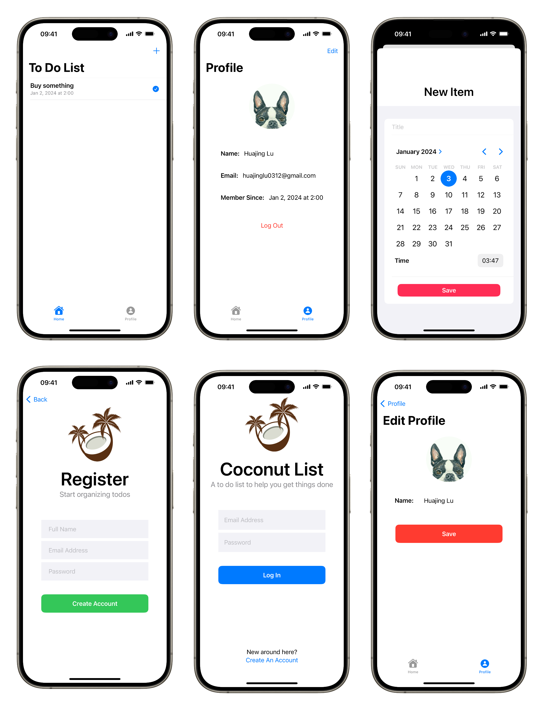

## CoconutList
It is a tutorial project from the YouTube channel “iOSAcademy” and it is my very first time to work with SwiftUI framework and firebase. Apart from all the contents from the tutorial, I have add some functions like profile edition. Coconut List is a simple and easy-to-use to-do list application.
## Screenshots

